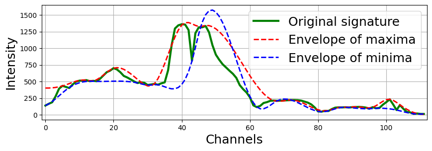

Empirical mode decomposition (EMD)
==================================

Empirical Mode Decomposition (EMD) is a signal processing method used to decompose a signal into a set of intrinsic mode functions (IMFs), which are oscillatory components obtained adaptively from the data. The method iteratively identifies local extrema, constructs upper and lower envelopes using spline interpolation, and computes a local mean to extract IMFs. A significant drawback of EMD lies in the accuracy of defining the local mean and envelopes, particularly near the boundaries of the data, where end effects can lead to distortions. These boundary issues and the reliance on spline interpolation may result in inaccuracies in the extracted modes.

.. image:: classic_emd_2.png
   :width: 869px
   :height: 305px
   :scale: 80 %

The 1D-EMD decomposition algorithm, adapted for hyperspectral image (HSI) analysis, incorporates several updates compared to the classical approach:
1. Precise calculation of the local mean using a moving average window instead of the arithmetic mean of the envelope maxima and minima of the signal.
2. Introduction of a rule for computing the local mean when the window extends beyond the range of spectral channels.
3. Flexibility to adapt the window size to scales smaller than the distance between adjacent zero-crossings in the current empirical mode (EM) or the initial window width.
4. Noise suppression in EMs by increasing the initial window size and applying it multiple times.

.. image:: swemd.png
   :width: 869px
   :height: 305px
   :scale: 80 %

Methods for decomposition into EMD
----------------------------------

.. automodule:: hsip.swemd.swemd
   :members:
   :undoc-members:
   :show-inheritance: