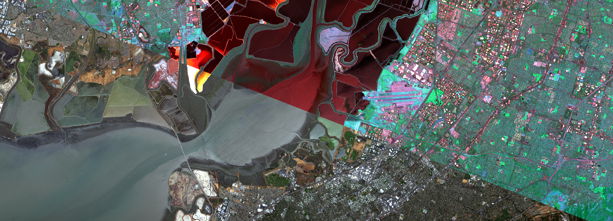

.. HSI Processing documentation master file, created by
   sphinx-quickstart on Thu Nov 28 16:07:41 2024.
   You can adapt this file completely to your liking, but it should at least
   contain the root `toctree` directive.

HSI Processing documentation
============================

Welcome to HSI Processing documentation!

.. toctree::
   :maxdepth: 3
   :caption: Contents:

   hsip.analysis
   hsip.clustering
   hsip.processing
   hsip.reader
   hsip.rgb
   hsip.swemd

