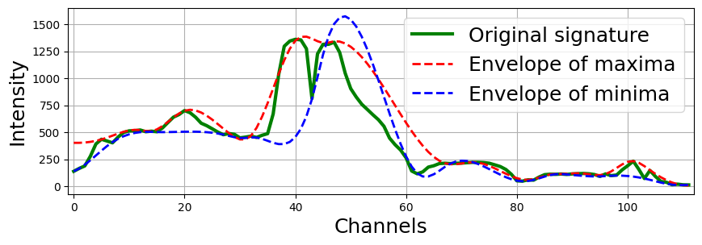

Разложение на эмпирические моды (EMD)
=====================================

Разложение на эмпирические моды — это метод обработки сигналов, используемый для разложения сигнала на набор собственных мод (IMFs), которые представляют собой осцилляторные компоненты. Метод итеративно выявляет локальные экстремумы, строит верхние и нижние огибающие с использованием сплайн-интерполяции и вычисляет локальное среднее для извлечения IMFs. Существенным недостатком EMD является точность определения локального среднего и огибающих, особенно вблизи границ данных, где выход за границы может привести к искажениям. Эти пограничные проблемы и зависимость от сплайн-интерполяции могут вызвать неточности в извлеченных модах.

.. image:: classic_emd_2.png
   :width: 869px
   :height: 305px
   :scale: 80 %

Алгоритм разложения SWEMD, адаптированный для анализа гиперспектральных изображений, включает несколько обновлений по сравнению с классическим подходом:

1) Точное вычисление локального среднего с использованием скользящего среднего окна, а не арифметического среднего значений максимума и минимума огибающих сигнала.
2) Введение правила для вычисления локального среднего, когда окно выходит за пределы диапазона спектральных каналов.
3) Гибкость в адаптации размера окна к меньшим масштабам, чем расстояние между соседними нулевыми пересечениями в текущей эмпирической моде (EM) или начальная ширина окна.
4) Подавление шума в эмпирических модах путем увеличения начального размера окна и его многократного применения.

.. image:: swemd.png
   :width: 869px
   :height: 305px
   :scale: 80 %

Methods for decomposition into EMD
----------------------------------

.. automodule:: hsip.swemd.swemd
   :members:
   :undoc-members:
   :show-inheritance: